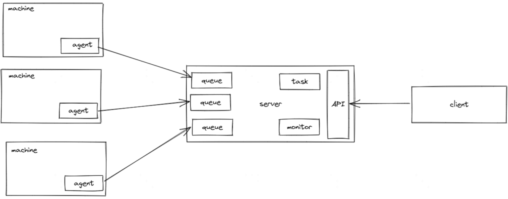

# sidebike

## 这是什么

一个轻量的、基于发布订阅模型的、开箱可用的 agent-server 库。
用于快速、简单地构建任务分发流程，用于简单的云控。

功能可参考 [rq](https://python-rq.org/)，但无python与redis依赖。一个二进制文件搞定一切。

## 初衷

- 起因是想利用 chaosblade 在业务实例上做一些实验；
- 但现在厂里基本都有完整的paas平台了，要么去改业务部署脚本，要么自己在平台登上去搞；
- 这两者的成本在开发迭代阶段会被放大，开开关关更新包，浪费大量时间在配置上；
- 而实验通常没有足够价值说服基建团队配合你搞；
- 因为安全限制，业务环境基本都在堡垒机背后，也不给你直接ssh，所以也很难在桌面端搞些自动脚本；
- **需要个东西让我能打完包直接放到业务实例（分组）上验证，过程尽量简化**；

很自然会想到部署一套 rq、celery ，业务实例当成 worker，往master发个任务就完事了。但：

- 有中间件成本：基本都是依赖mq管理的，而实验性质的东西信息量、可靠性等考量根本配不上mq，浪费钱；
- 要装agent：这俩都是python环境，而现在大部分都是瘦容器，别人为啥要配合你搞成胖容器；

搞点运维工具？ansible也可以，但：

- 同样有agent成本：当然你可以找到一个不需要agent的运维工具，暂时不展开；
- 配置成本高：用户目标并不是学会怎么写ansible剧本，只是想做实验；
- 平台不一定支持：都paas了，ssh直连统统给你屏蔽了，运维都由平台接管；

或者学 jvm-sandbox 在业务容器上开个http端口：

- 安全：业务为啥要在容器上给你开个口？且你的机器不一定能直接访问业务容器；
- 维护：你还是得靠记一堆ip来做自动化，而ip很可能是会变的；

综合上述，我最后需要的东西是：

- 类似rq的发布订阅管理
- agent / worker 没有额外依赖，最好是个二进制包
- 不要中间件

That's it.

## license

[Apache 2.0](LICENSE)
